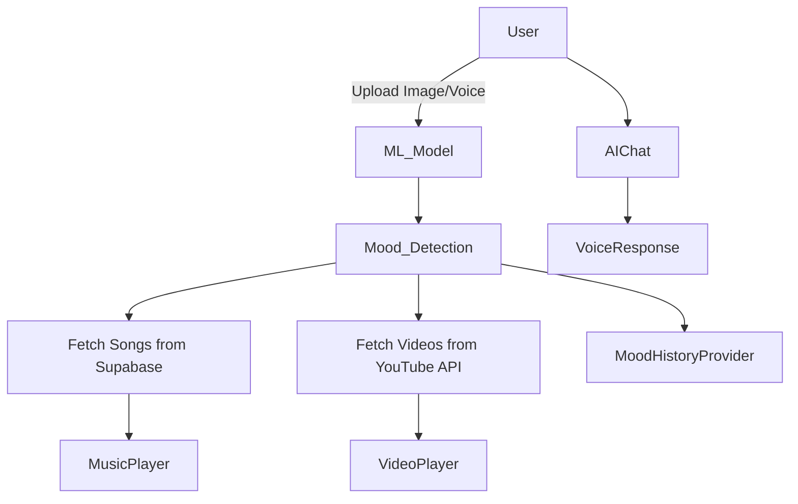

# 🎵 Emotion-Based Music & Video Recommendation App 🎬


---

## **Overview**
This Flutter application recommends **music and videos based on user mood**, detected via **face images** or **voice input**.  
It leverages **custom TFLite ML models**, **Supabase database**, and **YouTube API v3** to provide a **personalized entertainment experience**.  

**Key Features:**
- Mood detection via **face image** or **voice input**
- Mood-based **music recommendation** from Supabase
- **Music player** with play, pause, next, and auto-next functionality
- **Background music playback**
- Mood-based **video suggestions** using YouTube API
- **Video player** integration
- **Voice-enabled AI chat assistant**
- **Mood history tracking**
- **Provider state management** for reactive UI

---

## **Tech Stack**
- **Flutter**: Mobile UI and state management
- **Python FastAPI**: Audio emotion detection backend
- **TFLite**: Custom ML models for emotion prediction
- **Supabase**: Storage for songs, mood, and cover images
- **YouTube API v3**: Mood-based video fetching
- **Firebase Auth**: User authentication
- **Provider**: State management
- **Just Audio & Audio Session**: Music playback

---

## **Architecture & Workflow**

## Folder Structure
```
lib/
├── app.dart                 # Main app entry point
├── controller/              # Providers for state management
├── model/                   # Song and video models
├── services/                # Firebase & API services
├── ui/                      # Screens & widgets
│   ├── auth/                # Login/Signup
│   ├── chat-screen/
│   ├── emotion_detection_home_screen.dart
│   ├── music_player/
│   ├── video-player/
├── core/                    # Keys, constants, AI models
└── utils/                   # Theme & helper utilities

```


## Setup Instructions
```
Configure Firebase:

Add firebase_options.dart in lib/ (generated via flutterfire configure)

Configure Supabase:

Add your Supabase URL and key in lib/core/supabase_key.dart

Set up Python FastAPI server for audio emotion detection:
pip install fastapi uvicorn librosa tensorflow numpy
python app.py
Install Flutter dependencies:
flutter pub get
flutter run
```

